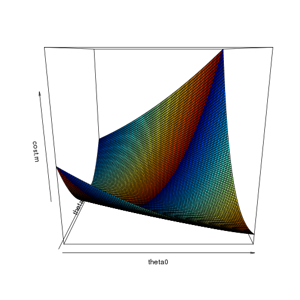
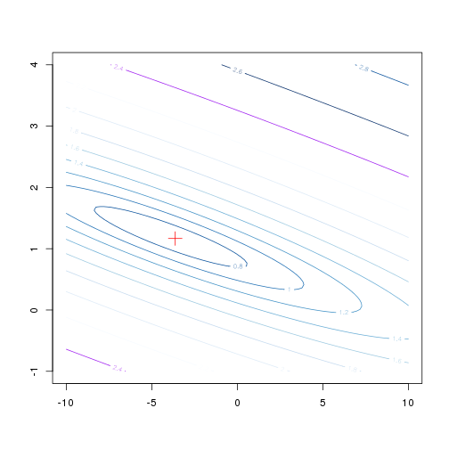
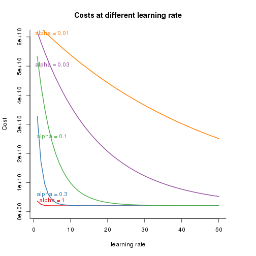

# ML. Excercise 1

## Warm up exercise


```r
m <- diag(5)
diag(m) <- 10
m
```

```
     [,1] [,2] [,3] [,4] [,5]
[1,]   10    0    0    0    0
[2,]    0   10    0    0    0
[3,]    0    0   10    0    0
[4,]    0    0    0   10    0
[5,]    0    0    0    0   10
```

## Univariate regression


```r
## load the data
dat <- read.table("./mlclass-ex1/ex1data1.txt", sep=",")

## plot the data
x <- dat[, 1]
y <- dat[, 2]

plot(x, y, col="red", pch=3,
     xlab="Population of City in 10,000s",
     ylab="Profit in $10,000s")

## univariate gradient

X <- cbind(1, x)
theta <- rep(0, 2)

iterations <- 1500
alpha <- 0.01

computeCost <- function(X, y, theta){
    n <- length(y)
    cost <- (1/(2 * n)) * t(X %*% theta - y) %*% (X %*% theta - y)
    as.vector(cost)
}

gradientDescent <- function(X, y, theta, alpha, iter.num){
    n <- length(y)
    cost.record <- rep(0, iter.num)
    for (i in 1:iter.num){
        # update regression parametrs
        h <- t(X %*% theta - y)
        m <- length(theta)
        tmp <- rep(0, m)
        for (j in 1:m){
            tmp[j] <- theta[j] - alpha * (1/n) * as.vector(h %*% X[, j])
        }
        theta <- tmp
        # record the cost history
        cost.record[i] <- computeCost(X, y, theta)
    }
    list(theta = theta, costs = cost.record)
}

res <- gradientDescent(X, y, theta, alpha, iterations)
model.theta <- res$theta

c(1, 3.5) %*% model.theta
```

```
          [,1]
[1,] 0.4519768
```

```r
c(1, 7) %*% model.theta
```

```
         [,1]
[1,] 4.534245
```

```r
abline(model.theta[1], model.theta[2], col="blue")
```

 

```r
n <- m <- 100
theta0 <- seq(-10, 10, len=n)
theta1 <- seq(-1, 4, len=m)

cost.m <- matrix(0, n, m)
for (i in 1:n){
    for (j in 1:m){
        tmp <- c(theta0[i], theta1[j])
        cost.m[i, j] <- computeCost(X, y, tmp)
    }
}

require("colorRamps")
```

```
Loading required package: colorRamps
```

```r
persp(theta0, theta1, cost.m, col=matlab.like(100))
```

 

```r
contour(theta0, theta1, log10(cost.m), col=c(rev(blues9), "purple"))
points(model.theta[1], model.theta[2], pch=3, col="red", cex=2)
```

 

## Multiple variables with linear regression

**feature normalization**


```r
## same as scale(X, center=T, scale=T)
featureNormalize <- function(X){
    X.norm <- apply(X, 2, function(x) (x - mean(x))/sd(x))
    mu <- apply(X, 2, mean)
    std <- apply(X, 2, sd)
    list(X.norm = X.norm,
         mu = mu,
         std = std)
}
```

## Gradient Descent


```r
# same form as univariate

computeCostMulti <- function(X, y, theta){
    n <- length(y)
    cost <- (1/(2 * n)) * t(X %*% theta - y) %*% (X %*% theta - y)
    as.vector(cost)
}

gradientDescentMulti <- function(X, y, theta, alpha, iter.num){
    n <- length(y)
    cost.record <- rep(0, iter.num)

    for (i in 1:iter.num){
        # update the theta
        theta <- theta - alpha * (1/n) * as.vector(t(t(X %*% theta - y) %*% X))
        # record the cost value in each iteration
        cost.record[i] <- computeCostMulti(X, y, theta)
    }
    list(theta=theta, costs=cost.record)
}

normalEqn <- function(X, y){
    solve(t(X) %*% X) %*% (t(X) %*% y)
}

dat <- read.table("./mlclass-ex1/ex1data2.txt", sep=",")

X <- dat[, 1:2]
y <- dat[, 3]

# normalization
res <- featureNormalize(X)
X <- res$X.norm
mu <- res$mu
std <- res$std

# add the intercept
X <- cbind(1, X)

alpha <- 0.01
iter.num <- 50
theta <- rep(0, ncol(X))

res <- gradientDescentMulti(X, y, theta, alpha, iter.num)

# different alphas
alpha.vec <- c(1, .3, 0.1, 0.03, 0.01)
resAll <- lapply(alpha.vec, function(x) gradientDescentMulti(X, y, theta, x, iter.num))

lapply(resAll, function(x) x$theta)
```

```
[[1]]
[1] 340412.660 110631.050  -6649.474

[[2]]
[1] 340412.653 110572.962  -6591.386

[[3]]
[1] 338658.2492 104127.5156   -172.2053

[[4]]
[1] 266180.45  75037.93  18970.04

[[5]]
[1] 134460.94  39283.23  16518.64
```

```r
require("RColorBrewer")
```

```
Loading required package: RColorBrewer
```

```r
n <- length(alpha.vec)
pal <- brewer.pal(n, "Set1")

bottom <- left <- top <- 0
right <- 2
op <- par(mar = par()$mar + c(bottom, left, top, right), bty = "l")
plot(1:iter.num, resAll[[1]]$cost, type="l", col = pal[1], ylim = c(1e-3, 6e10), lwd = 2, lty=1, main = "Costs at different learning rate", ylab = 'Cost', xlab = "learning rate")

#mtext(side=4, at=resAll[[1]]$cost[iter.num], text=paste("alpha =", alpha[1]), line=.3, las=2, col = pal[1])
text(5, resAll[[1]]$cost[5], labels=paste("alpha =", alpha.vec[1]), col = pal[1], pos=3)

for (i in 2:n){
    lines(1:iter.num, resAll[[i]]$cost, col=pal[i], lwd=2)
#    mtext(side=4, at=resAll[[i]]$cost[iter.num], text=paste("alpha =", alpha[i]), line=.3, las=2, col=pal[i])
    text(5, resAll[[i]]$cost[5], labels=paste("alpha =", alpha.vec[i]), col = pal[i], pos=3)
}
```

 

```r
par(op)

# plot(1:iter.num,
#      resAll[[1]]$cost,
#      type="l",
#      col=pal[1],
#      ylim = c(1e-5, 7e10))
# for (i in 2:n){
#     points(1:iter.num, resAll[[i]]$cost, type="l", col=pal[i])
# }
#
# legend("topright", lty = 1,
#        legend=c("alpha = 1",
#                 "alpha = .3",
#                 "alpha = .1",
#                 "alpha = .03",
#                 "alpha = .01",
#                 "alpha = .03"),
#        col = pal)

normalEqn(X, y)
```

```
         [,1]
   340412.660
V1 110631.050
V2  -6649.474
```
