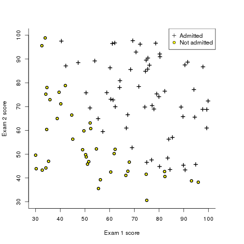
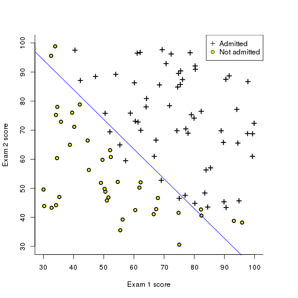
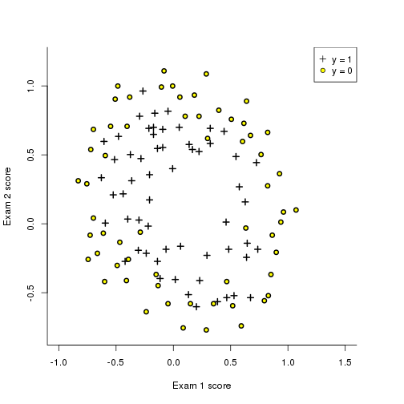
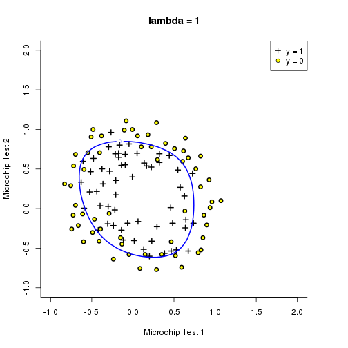
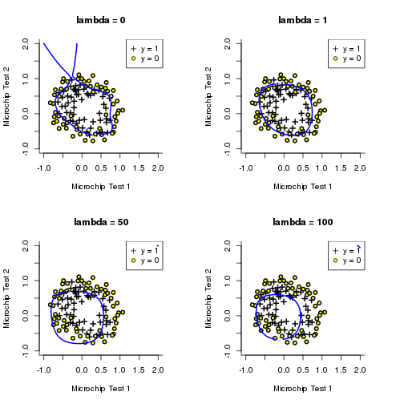

## Logistic regression


```r
# plot the data
dat <- read.table("./mlclass-ex2/ex2data1.txt", sep=",")

pos <- dat[, 3] == 1
bottom <- left <- top <- 0
right <- 2
op <- par(mar = par()$mar + c(bottom, left, top, right), bty = "l")
plot(dat[pos, 1], dat[pos, 2], col = "black", pch=3, xlim=c(30, 100), ylim=c(30, 100), xlab="Exam 1 score", ylab="Exam 2 score", lwd=2)
points(dat[!pos, 1], dat[!pos, 2], bg="yellow", pch=21, lwd=2)
legend("topright", legend=c("Admitted", "Not admitted"), pt.bg=c("black", "yellow"), pch=c(3, 21))
```

 

```r
par(op)
```

## sigmoid function


```r
sigmoid <- function(z){

    1 / (1 + exp(-z))

}

sigmoid(10000)
```

```
[1] 1
```

```r
sigmoid(-10000)
```

```
[1] 0
```

```r
sigmoid(0)
```

```
[1] 0.5
```

```r
m <- matrix(1:4, 2, 2)
sigmoid(m)
```

```
          [,1]      [,2]
[1,] 0.7310586 0.9525741
[2,] 0.8807971 0.9820138
```

## cost function in logistic regression


```r
costFunction <- function(theta, X, y){

    # compute the cost and gradient for logistic regression
    n <- length(y)
    h <- sigmoid(X %*% theta)
    cPos <- -t(y) %*% log(h)
    cNeg <- t(1 - y) %*% log(1 - h)
    J <- as.vector((1/n) * (cPos - cNeg))
    grad <- (1/n) * (t(X) %*% (h - y))
    list(cost=J, grad=grad)

}
cf <- function(theta, X, y){
    n <- length(y)
    h <- sigmoid(X %*% theta)
    cPos <- as.vector(-t(y) %*% log(h))
    cNeg <- as.vector(t(1 - y) %*% log(1 - h))
    J <- (1/n) * (cPos - cNeg)
    J
}

gradientFun <- function(theta, X, y){
    n <- length(y)
    h <- sigmoid(X %*% theta)
    grad <- (1/n) * (t(X) %*% (h - y))
    grad
}

X <- dat[, 1:2]
y <- dat[, 3]
X <- as.matrix(cbind(1, X))

theta <- rep(0, ncol(X))

costFunction(theta, X, y)
```

```
$cost
[1] 0.6931472

$grad
        [,1]
1   -0.10000
V1 -12.00922
V2 -11.26284
```

```r
cf(theta, X, y)
```

```
[1] 0.6931472
```

# optimization in R


```r
res <- nlminb(theta, cf, gradientFun, X=X, y=y, control=list(maxit=4000, trace=1))
```

```
  0:    0.69314718:  0.00000  0.00000  0.00000
```

```
Warning in nlminb(theta, cf, gradientFun, X = X, y = y, control =
list(maxit = 4000, : NA/NaN function evaluation
```

```
  1:    0.63236908: 5.16025e-05 0.00619705 0.00581191
  2:    0.62984790: -0.00102964 0.0115760 -0.000675205
  3:    0.62855673: -0.0348445 0.00873008 0.00117044
  4:    0.60412873: -0.409691 0.00792297 0.00865042
  5:    0.52162071: -1.90926 0.0140512 0.0264977
  6:    0.34337103: -6.98746 0.0476649 0.0713854
  7:    0.26965184: -10.7335 0.0819736 0.0956655
  8:    0.23084873: -14.4796 0.117023 0.119216
  9:    0.21305866: -18.2257 0.150889 0.144167
 10:    0.20701303: -21.1845 0.176370 0.165474
 11:    0.20498752: -23.3177 0.193828 0.182105
 12:    0.20422845: -24.6390 0.203990 0.193418
 13:    0.20381504: -25.4000 0.209274 0.200918
 14:    0.20358403: -25.6127 0.210107 0.204220
 15:    0.20350958: -25.4060 0.208023 0.203467
 16:    0.20349889: -25.2130 0.206489 0.202026
 17:    0.20349787: -25.1572 0.206128 0.201498
 18:    0.20349774: -25.1531 0.206141 0.201420
 19:    0.20349771: -25.1572 0.206194 0.201439
 20:    0.20349770: -25.1609 0.206229 0.201467
 21:    0.20349770: -25.1613 0.206232 0.201471
 22:    0.20349770: -25.1613 0.206232 0.201472
```

```r
cat("the final cost is: ", res$objective, "\n")
```

```
the final cost is:  0.2034977 
```

```r
cat("the parameter for theta is: ", res$par, "\n")
```

```
the parameter for theta is:  -25.16134 0.2062317 0.2014716 
```

# plot the decision boundary


```r
slope <- -res$par[2]/res$par[3]
intercept <- -res$par[1]/res$par[3]
op <- par(mar = par()$mar + c(bottom, left, top, right), bty = "l")
plot(dat[pos, 1], dat[pos, 2], col = "black", pch=3, xlim=c(30, 100), ylim=c(30, 100), xlab="Exam 1 score", ylab="Exam 2 score", lwd=2)
points(dat[!pos, 1], dat[!pos, 2], bg="yellow", pch=21, lwd=2)
abline(a=intercept, b=slope, col="blue")
legend("topright", legend=c("Admitted", "Not admitted"), pt.bg=c("black", "yellow"), pch=c(3, 21))
```

 

```r
par(op)
```

## Evaluation the prediction


```r
prob <- sigmoid(as.vector(c(1, 45, 85) %*% res$par))
prob
```

```
[1] 0.7762907
```

```r
predictClassProb <- function(theta, X){
    sigmoid(X %*% theta)
}
probs <- as.vector(predictClassProb(res$par, X))
probs <- ifelse(probs > 0.5, 1, 0)
acc <- table(probs, y)
cat("The predict accuracy is ", 100 * sum(diag(acc)) / sum(acc), "%.\n", sep="")
```

```
The predict accuracy is 89%.
```

# Regularized logistic regression


```r
dat <- read.table("./mlclass-ex2/ex2data2.txt", sep=",")
pos <- dat[, 3] == 1
op <- par(mar = par()$mar + c(bottom, left, top, right), bty = "l")
plot(dat[pos, 1], dat[pos, 2], col = "black", pch=3, xlim=c(-1, 1.5), ylim=c(-0.8, 1.2), xlab="Exam 1 score", ylab="Exam 2 score", lwd=2)
points(dat[!pos, 1], dat[!pos, 2], bg="yellow", pch=21, lwd=2)
legend("topright", legend=c("y = 1", "y = 0"), pt.bg=c("black", "yellow"), pch=c(3, 21))
```

 

```r
par(op)
```


```r
mapFeature <- function(X1, X2){
    # two single features
    n <- 6
    m <- matrix(1, nrow=length(X1), ncol=1)
    for (i in 1:n){
        for (j in 0:i){
            m <- cbind(m, X1^(i - j) * X2^(j))
        }
    }
    m
}

costFunReg <- function(theta, X, y, lambda){
    n <- length(y)
    costs <- cf(theta, X, y)
    theta.filter <- c(0, theta[-1])
    costs <- costs + (lambda / (2*n)) * as.vector(t(theta.filter) %*% theta.filter)
    costs
}
gradientFunReg <- function(theta, X, y, lambda){
    n <- length(y)
    grad <- gradientFun(theta, X, y)
    theta.filter <- c(0, theta[-1])
    grad <- grad + (lambda / n) * theta.filter
    grad
}

# initiation
X <- dat[, 1:2]
y <- dat[, 3]
X <- mapFeature(X[, 1], X[, 2])
theta <- rep(0, ncol(X))
lambda <- 1
costFunReg(theta, X, y, lambda)
```

```
[1] 0.6931472
```

```r
res <- nlminb(theta, costFunReg, gradientFunReg, X=X, y=y, lambda = lambda, control=list(maxit=4000, trace=1))
```

```
  0:    0.69314718:  0.00000  0.00000  0.00000  0.00000  0.00000  0.00000  0.00000  0.00000  0.00000  0.00000  0.00000  0.00000  0.00000  0.00000  0.00000  0.00000  0.00000  0.00000  0.00000  0.00000  0.00000  0.00000  0.00000  0.00000  0.00000  0.00000  0.00000  0.00000
  1:    0.68129125: -0.00847458 -0.0187881 -7.77712e-05 -0.0503446 -0.0115013 -0.0376648 -0.0183560 -0.00732393 -0.00819244 -0.0234765 -0.0393486 -0.00223924 -0.0128601 -0.00309594 -0.0393028 -0.0199707 -0.00432983 -0.00338644 -0.00583822 -0.00447629 -0.0310080 -0.0310312 -0.00109740 -0.00631571 -0.000408503 -0.00726504 -0.00137646 -0.0387936
  2:    0.64702881: 0.0243649 -0.0854821 0.0296065 -0.257134 -0.0634051 -0.177199 -0.0885764 -0.0361715 -0.0424891 -0.106677 -0.204617 -0.0115503 -0.0662124 -0.0170412 -0.194295 -0.100291 -0.0222323 -0.0170833 -0.0297233 -0.0239323 -0.151008 -0.161655 -0.00530052 -0.0330220 -0.00195402 -0.0375197 -0.00761594 -0.194013
  3:    0.61725652: 0.161746 -0.168837 0.116832 -0.578948 -0.150103 -0.375081 -0.187488 -0.0795937 -0.0960326 -0.217965 -0.465881 -0.0259061 -0.150082 -0.0402049 -0.426994 -0.220721 -0.0503190 -0.0377334 -0.0668462 -0.0554928 -0.327388 -0.368128 -0.0112347 -0.0756037 -0.00406507 -0.0852015 -0.0180286 -0.429805
  4:    0.59825791: 0.361409 -0.214013 0.233571 -0.859730 -0.231677 -0.530135 -0.260261 -0.116380 -0.142133 -0.297527 -0.697434 -0.0382365 -0.224025 -0.0619702 -0.622655 -0.319620 -0.0752777 -0.0546308 -0.0993005 -0.0843168 -0.471842 -0.551119 -0.0157999 -0.113663 -0.00556983 -0.127396 -0.0280332 -0.631036
  5:    0.57774453: 0.711036 -0.231516 0.439977 -1.24159 -0.348801 -0.722062 -0.337935 -0.165515 -0.202607 -0.384105 -1.01517 -0.0544370 -0.325246 -0.0931838 -0.879372 -0.443678 -0.109965 -0.0755225 -0.143491 -0.124766 -0.655709 -0.801920 -0.0211363 -0.166247 -0.00708052 -0.185263 -0.0427771 -0.898073
  6:    0.56598641: 0.988576 -0.185918 0.616804 -1.47929 -0.426735 -0.824063 -0.358665 -0.195498 -0.236391 -0.413966 -1.21383 -0.0633872 -0.388690 -0.113826 -1.02771 -0.506378 -0.132414 -0.0855780 -0.170932 -0.150827 -0.754207 -0.957823 -0.0232704 -0.199550 -0.00727047 -0.221472 -0.0530099 -1.05436
  7:    0.55689420:  1.18659 -0.0785360 0.768436 -1.59927 -0.471464 -0.855332 -0.327031 -0.210216 -0.247088 -0.395696 -1.31287 -0.0658048 -0.421229 -0.125399 -1.08576 -0.514732 -0.144929 -0.0860300 -0.184614 -0.164802 -0.779580 -1.03351 -0.0224141 -0.216884 -0.00615897 -0.239748 -0.0594057 -1.11664
  8:    0.54991596:  1.27477 0.0769467 0.881976 -1.61599 -0.484779 -0.833406 -0.251129 -0.212342 -0.237595 -0.340646 -1.32147 -0.0622583 -0.426663 -0.128368 -1.06640 -0.474816 -0.148603 -0.0781731 -0.186266 -0.167706 -0.741889 -1.03562 -0.0188877 -0.219859 -0.00391522 -0.242064 -0.0620318 -1.09561
  9:    0.54519059:  1.26035 0.221745 0.947628 -1.59903 -0.484118 -0.810768 -0.172122 -0.211740 -0.223167 -0.288330 -1.29665 -0.0570587 -0.423243 -0.127637 -1.02804 -0.423354 -0.149062 -0.0688161 -0.184178 -0.166331 -0.690414 -1.01000 -0.0149070 -0.217602 -0.00163492 -0.238919 -0.0627460 -1.04989
 10:    0.54019665:  1.20958 0.377828  1.01696 -1.62039 -0.493498 -0.821825 -0.0912169 -0.218342 -0.213612 -0.246574 -1.29635 -0.0527392 -0.430441 -0.129709 -1.01443 -0.375493 -0.153368 -0.0604990 -0.186822 -0.168732 -0.651925 -1.00121 -0.0109086 -0.220124 0.000688309 -0.241214 -0.0648671 -1.02364
 11:    0.53464560:  1.14493 0.584787  1.13292 -1.74107 -0.534699 -0.902233 0.00359359 -0.242356 -0.216225 -0.217430 -1.36465 -0.0509562 -0.465390 -0.140772 -1.05923 -0.334508 -0.168113 -0.0540605 -0.201708 -0.182224 -0.640961 -1.04110 -0.00668352 -0.235776 0.00327333 -0.258064 -0.0717829 -1.04630
 12:    0.53292713:  1.14735 0.650571  1.19625 -1.85899 -0.576706 -0.982356 0.0235308 -0.263654 -0.231753 -0.228310 -1.44668 -0.0545290 -0.498936 -0.153053 -1.12701 -0.340864 -0.180990 -0.0561698 -0.216597 -0.196600 -0.670548 -1.09924 -0.00646037 -0.251716 0.00346254 -0.275663 -0.0784505 -1.10254
 13:    0.53250545:  1.17059 0.652409  1.21790 -1.92058 -0.604189 -1.02687 0.0182773 -0.275696 -0.245067 -0.242063 -1.49269 -0.0585759 -0.517245 -0.161927 -1.16799 -0.353783 -0.187981 -0.0594621 -0.225077 -0.205977 -0.693228 -1.13338 -0.00746269 -0.260556 0.00272495 -0.285546 -0.0831429 -1.13817
 14:    0.53229158:  1.18842 0.645204  1.22321 -1.94767 -0.624468 -1.05170 0.0146168 -0.283370 -0.255092 -0.248817 -1.51246 -0.0621009 -0.526810 -0.169292 -1.18728 -0.359427 -0.191998 -0.0616799 -0.229859 -0.212716 -0.701532 -1.14761 -0.00840993 -0.265020 0.00181588 -0.290615 -0.0871807 -1.15240
 15:    0.53183505:  1.21869 0.633211  1.22565 -1.98536 -0.671757 -1.09953 0.0156013 -0.300060 -0.277315 -0.255159 -1.53652 -0.0704140 -0.543817 -0.187545 -1.21414 -0.361077 -0.200001 -0.0655112 -0.238977 -0.228143 -0.703774 -1.16266 -0.0103957 -0.272492 -0.000525306 -0.299217 -0.0974866 -1.16410
 16:    0.53105866:  1.25498 0.623165  1.21962 -2.02309 -0.758726 -1.17576 0.0327103 -0.329431 -0.316278 -0.253219 -1.55239 -0.0854926 -0.568644 -0.222430 -1.23982 -0.347428 -0.213083 -0.0704845 -0.253226 -0.256187 -0.684272 -1.16656 -0.0135183 -0.282563 -0.00496637 -0.311010 -0.117587 -1.15679
 17:    0.53008544:  1.28030 0.624672  1.19970 -2.03821 -0.879145 -1.26824 0.0753991 -0.368550 -0.367961 -0.233568 -1.54048 -0.105863 -0.595579 -0.272280 -1.24693 -0.308076 -0.229214 -0.0747838 -0.269996 -0.294714 -0.628132 -1.14336 -0.0170205 -0.292212 -0.0111659 -0.322616 -0.146792 -1.11155
 18:    0.52951009:  1.27149 0.639908  1.17744 -2.01267 -0.953284 -1.31388 0.119902 -0.391083 -0.397796 -0.204502 -1.50084 -0.117560 -0.605384 -0.304410 -1.22403 -0.264136 -0.237140 -0.0748902 -0.277534 -0.318281 -0.564676 -1.10160 -0.0181266 -0.294162 -0.0148763 -0.325376 -0.166073 -1.04932
 19:    0.52936459:  1.25042 0.651568  1.17008 -1.98376 -0.954514 -1.30670 0.136013 -0.390040 -0.396840 -0.188740 -1.47313 -0.116534 -0.600284 -0.306085 -1.20059 -0.246637 -0.235414 -0.0726480 -0.275370 -0.318704 -0.537907 -1.07760 -0.0168848 -0.290990 -0.0146241 -0.321900 -0.167455 -1.01827
 20:    0.52933187:  1.24021 0.653980  1.17160 -1.97327 -0.941309 -1.29609 0.136501 -0.385091 -0.391001 -0.184301 -1.46518 -0.113145 -0.596119 -0.300913 -1.19170 -0.244993 -0.232743 -0.0712570 -0.272814 -0.314712 -0.533216 -1.07178 -0.0155248 -0.289028 -0.0135126 -0.319641 -0.164565 -1.01127
 21:    0.52930156:  1.23365 0.652630  1.17576 -1.96855 -0.929837 -1.29098 0.134923 -0.380724 -0.386543 -0.180436 -1.46129 -0.109300 -0.593915 -0.296150 -1.18635 -0.245222 -0.230253 -0.0700893 -0.270958 -0.311535 -0.529275 -1.06880 -0.0137171 -0.287952 -0.0121225 -0.318388 -0.161855 -1.00629
 22:    0.52924795:  1.22790 0.645413  1.18542 -1.96809 -0.917748 -1.29445 0.131920 -0.375680 -0.382981 -0.172929 -1.45845 -0.102619 -0.593998 -0.290684 -1.18144 -0.245651 -0.226772 -0.0683920 -0.269430 -0.308894 -0.519491 -1.06539 -0.00989032 -0.287672 -0.00947866 -0.318069 -0.158714 -0.996793
 23:    0.52920165:  1.22909 0.635552  1.19459 -1.97497 -0.916545 -1.30997 0.129909 -0.374493 -0.384383 -0.166301 -1.45961 -0.0974026 -0.598010 -0.289372 -1.18184 -0.245497 -0.224941 -0.0673122 -0.270010 -0.309769 -0.508484 -1.06398 -0.00617352 -0.289027 -0.00717206 -0.319687 -0.157903 -0.988001
 24:    0.52916308:  1.23724 0.623205  1.20301 -1.98888 -0.924921 -1.33832 0.128986 -0.376817 -0.390059 -0.160431 -1.46426 -0.0928735 -0.605972 -0.291559 -1.18734 -0.244554 -0.224432 -0.0665469 -0.272633 -0.313721 -0.495569 -1.06401 -0.00211518 -0.291973 -0.00487840 -0.323236 -0.159016 -0.979078
 25:    0.52914682:  1.24400 0.618980  1.20385 -1.99646 -0.931860 -1.35438 0.129615 -0.379373 -0.393422 -0.159659 -1.46713 -0.0914445 -0.610487 -0.293684 -1.19192 -0.243604 -0.224855 -0.0662360 -0.274563 -0.316186 -0.490741 -1.06443 -0.000459674 -0.293674 -0.00400098 -0.325356 -0.160100 -0.976164
 26:    0.52912249:  1.25395 0.615631  1.20181 -2.00514 -0.938874 -1.37620 0.131182 -0.382526 -0.396109 -0.160112 -1.46979 -0.0885803 -0.616177 -0.295371 -1.19811 -0.241822 -0.225062 -0.0652334 -0.277103 -0.318377 -0.484823 -1.06405 0.00224356 -0.295721 -0.00241966 -0.328066 -0.160782 -0.972059
 27:    0.52908797:  1.26536 0.613865  1.19659 -2.01261 -0.940192 -1.40233 0.133344 -0.384442 -0.395287 -0.161338 -1.47031 -0.0821558 -0.622078 -0.294058 -1.20413 -0.239154 -0.223867 -0.0627210 -0.279555 -0.318388 -0.476754 -1.06135 0.00703402 -0.297606 0.000683373 -0.330858 -0.159526 -0.964876
 28:    0.52904485:  1.27592 0.614540  1.18818 -2.01617 -0.929547 -1.42999 0.135566 -0.383034 -0.387888 -0.162840 -1.46667 -0.0701447 -0.626878 -0.287030 -1.20778 -0.235725 -0.220026 -0.0579113 -0.281057 -0.314129 -0.465775 -1.05490 0.0148351 -0.298695 0.00606429 -0.333058 -0.154718 -0.952893
 29:    0.52902038:  1.27722 0.617485  1.18252 -2.01234 -0.911422 -1.43880 0.135937 -0.378251 -0.377548 -0.163300 -1.46057 -0.0598433 -0.626652 -0.277873 -1.20543 -0.234063 -0.215570 -0.0537310 -0.280165 -0.307542 -0.459010 -1.04853 0.0207338 -0.297941 0.0103882 -0.332826 -0.148913 -0.943444
 30:    0.52901469:  1.27326 0.619565  1.18180 -2.00769 -0.901268 -1.43317 0.135043 -0.374813 -0.372226 -0.162953 -1.45725 -0.0567538 -0.624173 -0.273473 -1.20158 -0.234395 -0.213565 -0.0524235 -0.278701 -0.303945 -0.458337 -1.04625 0.0220882 -0.296780 0.0115355 -0.331573 -0.146272 -0.940887
 31:    0.52901386:  1.27123 0.620100  1.18226 -2.00637 -0.899538 -1.42917 0.134443 -0.373911 -0.371221 -0.162780 -1.45675 -0.0568487 -0.623019 -0.272871 -1.20000 -0.234904 -0.213263 -0.0523918 -0.278168 -0.303224 -0.458940 -1.04620 0.0218683 -0.296337 0.0114411 -0.331000 -0.145931 -0.940888
 32:    0.52901318:  1.27002 0.620456  1.18247 -2.00606 -0.899194 -1.42655 0.133866 -0.373396 -0.370587 -0.162810 -1.45673 -0.0570200 -0.622255 -0.272742 -1.19884 -0.235415 -0.213078 -0.0523359 -0.277882 -0.302799 -0.459269 -1.04636 0.0217158 -0.296049 0.0113626 -0.330615 -0.145826 -0.940657
 33:    0.52901146:  1.26834 0.621298  1.18225 -2.00677 -0.899580 -1.42248 0.132418 -0.372421 -0.368942 -0.163301 -1.45718 -0.0570074 -0.620895 -0.272670 -1.19642 -0.236666 -0.212531 -0.0519048 -0.277500 -0.301796 -0.459332 -1.04674 0.0217668 -0.295509 0.0114326 -0.329904 -0.145607 -0.939162
 34:    0.52900885:  1.26761 0.622597  1.18081 -2.00980 -0.901666 -1.41974 0.130182 -0.371273 -0.366177 -0.164664 -1.45843 -0.0562590 -0.619534 -0.272786 -1.19334 -0.238542 -0.211514 -0.0507852 -0.277354 -0.300239 -0.458344 -1.04725 0.0225090 -0.294909 0.0119587 -0.329150 -0.145253 -0.935518
 35:    0.52900664:  1.26873 0.623617  1.17875 -2.01386 -0.904608 -1.42081 0.128445 -0.370675 -0.363804 -0.166291 -1.45990 -0.0550072 -0.619124 -0.273067 -1.19155 -0.239946 -0.210549 -0.0494966 -0.277633 -0.299005 -0.456621 -1.04754 0.0236919 -0.294644 0.0127510 -0.328867 -0.144953 -0.931496
 36:    0.52900507:  1.27167 0.624423  1.17603 -2.01907 -0.908568 -1.42564 0.127087 -0.370531 -0.361665 -0.168297 -1.46158 -0.0532002 -0.619582 -0.273523 -1.19094 -0.240968 -0.209561 -0.0479653 -0.278327 -0.298005 -0.454134 -1.04761 0.0253687 -0.294671 0.0138469 -0.329013 -0.144682 -0.926923
 37:    0.52900484:  1.27284 0.624344  1.17560 -2.01991 -0.909392 -1.42804 0.127219 -0.370727 -0.361669 -0.168655 -1.46173 -0.0527965 -0.620055 -0.273652 -1.19161 -0.240805 -0.209469 -0.0477386 -0.278584 -0.298072 -0.453626 -1.04743 0.0257366 -0.294817 0.0140775 -0.329247 -0.144681 -0.926411
 38:    0.52900471:  1.27345 0.624214  1.17565 -2.02001 -0.909761 -1.42951 0.127417 -0.370805 -0.361829 -0.168827 -1.46161 -0.0526438 -0.620320 -0.273723 -1.19224 -0.240593 -0.209439 -0.0476775 -0.278703 -0.298188 -0.453528 -1.04723 0.0258814 -0.294896 0.0141662 -0.329392 -0.144696 -0.926467
 39:    0.52900453:  1.27394 0.624121  1.17596 -2.01995 -0.910314 -1.43090 0.127504 -0.370675 -0.361857 -0.169167 -1.46134 -0.0524903 -0.620408 -0.273814 -1.19288 -0.240444 -0.209295 -0.0475568 -0.278768 -0.298215 -0.453587 -1.04690 0.0260456 -0.294889 0.0142723 -0.329464 -0.144688 -0.926559
 40:    0.52900409:  1.27452 0.624123  1.17693 -2.01973 -0.911828 -1.43303 0.127270 -0.369929 -0.361434 -0.170219 -1.46064 -0.0521606 -0.620104 -0.274027 -1.19383 -0.240443 -0.208731 -0.0471373 -0.278767 -0.297969 -0.453945 -1.04611 0.0264318 -0.294659 0.0145354 -0.329383 -0.144598 -0.926537
 41:    0.52900347:  1.27464 0.624436  1.17865 -2.01941 -0.914391 -1.43468 0.126314 -0.368245 -0.360126 -0.172129 -1.45955 -0.0516937 -0.618973 -0.274344 -1.19446 -0.240929 -0.207586 -0.0463181 -0.278564 -0.297175 -0.454731 -1.04492 0.0270219 -0.294031 0.0149548 -0.328933 -0.144369 -0.926116
 42:    0.52900298:  1.27401 0.624983  1.18024 -2.01917 -0.916687 -1.43447 0.124976 -0.366382 -0.358444 -0.173949 -1.45867 -0.0513490 -0.617436 -0.274591 -1.19417 -0.241783 -0.206400 -0.0454880 -0.278213 -0.296140 -0.455578 -1.04399 0.0274989 -0.293267 0.0153104 -0.328261 -0.144097 -0.925394
 43:    0.52900276:  1.27303 0.625498  1.18111 -2.01911 -0.917872 -1.43287 0.123866 -0.365111 -0.357129 -0.174985 -1.45830 -0.0512328 -0.616179 -0.274687 -1.19327 -0.242588 -0.205650 -0.0449729 -0.277883 -0.295322 -0.456138 -1.04363 0.0277015 -0.292693 0.0154773 -0.327676 -0.143899 -0.924715
 44:    0.52900274:  1.27273 0.625581  1.18103 -2.01916 -0.917716 -1.43210 0.123735 -0.365075 -0.357006 -0.174916 -1.45840 -0.0512861 -0.616034 -0.274654 -1.19289 -0.242719 -0.205658 -0.0449808 -0.277828 -0.295242 -0.456147 -1.04374 0.0276477 -0.292649 0.0154457 -0.327594 -0.143886 -0.924600
 45:    0.52900274:  1.27268 0.625574  1.18094 -2.01919 -0.917579 -1.43192 0.123765 -0.365150 -0.357051 -0.174825 -1.45846 -0.0513101 -0.616062 -0.274636 -1.19282 -0.242707 -0.205713 -0.0450156 -0.277830 -0.295268 -0.456116 -1.04381 0.0276164 -0.292669 0.0154244 -0.327602 -0.143895 -0.924604
 46:    0.52900274:  1.27268 0.625565  1.18092 -2.01920 -0.917544 -1.43189 0.123781 -0.365175 -0.357069 -0.174805 -1.45847 -0.0513118 -0.616070 -0.274633 -1.19281 -0.242694 -0.205731 -0.0450222 -0.277832 -0.295279 -0.456109 -1.04381 0.0276110 -0.292674 0.0154208 -0.327605 -0.143898 -0.924610
 47:    0.52900274:  1.27268 0.625520  1.18086 -2.01929 -0.917422 -1.43179 0.123850 -0.365276 -0.357138 -0.174756 -1.45849 -0.0513005 -0.616075 -0.274626 -1.19278 -0.242620 -0.205801 -0.0450308 -0.277837 -0.295320 -0.456101 -1.04381 0.0276024 -0.292680 0.0154159 -0.327605 -0.143907 -0.924630
 48:    0.52900274:  1.27268 0.625446  1.18083 -2.01945 -0.917306 -1.43168 0.123940 -0.365394 -0.357213 -0.174750 -1.45848 -0.0512563 -0.616033 -0.274629 -1.19275 -0.242498 -0.205885 -0.0450090 -0.277838 -0.295364 -0.456123 -1.04374 0.0276136 -0.292663 0.0154263 -0.327584 -0.143915 -0.924651
 49:    0.52900273:  1.27270 0.625320  1.18086 -2.01972 -0.917225 -1.43155 0.124061 -0.365527 -0.357287 -0.174843 -1.45839 -0.0511467 -0.615893 -0.274652 -1.19273 -0.242289 -0.205984 -0.0449232 -0.277830 -0.295406 -0.456206 -1.04355 0.0276671 -0.292596 0.0154688 -0.327522 -0.143919 -0.924672
 50:    0.52900273:  1.27272 0.625229  1.18097 -2.01994 -0.917283 -1.43154 0.124119 -0.365560 -0.357288 -0.175016 -1.45826 -0.0510301 -0.615719 -0.274687 -1.19276 -0.242134 -0.206012 -0.0448100 -0.277814 -0.295404 -0.456316 -1.04332 0.0277418 -0.292509 0.0155259 -0.327447 -0.143910 -0.924670
 51:    0.52900273:  1.27273 0.625216  1.18106 -2.01999 -0.917393 -1.43160 0.124099 -0.365508 -0.357241 -0.175133 -1.45819 -0.0509818 -0.615631 -0.274708 -1.19279 -0.242110 -0.205978 -0.0447496 -0.277802 -0.295375 -0.456374 -1.04322 0.0277833 -0.292463 0.0155567 -0.327411 -0.143900 -0.924655
 52:    0.52900273:  1.27274 0.625229  1.18109 -2.01997 -0.917436 -1.43163 0.124077 -0.365475 -0.357218 -0.175153 -1.45818 -0.0509827 -0.615624 -0.274711 -1.19280 -0.242132 -0.205956 -0.0447436 -0.277799 -0.295362 -0.456380 -1.04321 0.0277880 -0.292458 0.0155599 -0.327409 -0.143896 -0.924648
 53:    0.52900273:  1.27274 0.625234  1.18109 -2.01996 -0.917441 -1.43164 0.124071 -0.365470 -0.357214 -0.175152 -1.45818 -0.0509858 -0.615627 -0.274710 -1.19280 -0.242140 -0.205952 -0.0447453 -0.277799 -0.295360 -0.456378 -1.04322 0.0277867 -0.292459 0.0155591 -0.327410 -0.143895 -0.924647
```

```r
getIntInterval <- function(x){
    x <- range(x)
    x[1] <- floor(x[1])
    x[2] <- ceiling(x[2])
    x
}

plotRegBoundry <- function(theta, X1, X2, y, lambda, ...){

    pos <- y == 1
    op <- par(mar = par()$mar + c(0, 0, 0, 2), bty = "l")
    plot(X1[pos], X2[pos], col = "black", pch=3,
         xlim=getIntInterval(X1),
         ylim=getIntInterval(X2),
         lwd=2,
         main=paste0("lambda = ", lambda),
         ...)
    points(X1[!pos], X2[!pos], bg="yellow", pch=21, lwd=2)
    legend("topright", legend=c("y = 1", "y = 0"), pt.bg=c("black", "yellow"), pch=c(3, 21))

    u <- getIntInterval(X1)
    v <- getIntInterval(X2)
    u <- seq(u[1], u[2], length.out=50)
    v <- seq(v[1], v[2], length.out=50)
    z <- matrix(0, length(u), length(v))
    for (i in 1:length(u)){
        for (j in 1:length(v)){
            z[i, j] <- mapFeature(u[i], v[j]) %*% theta
        }
    }

    # z <- t(z)
    contour(u, v, z, add=T, lwd=2, col="blue", nlevels=1)

    par(op)
}

plotRegBoundry(res$par, dat[, 1], dat[, 2], y, lambda,
               xlab="Microchip Test 1", ylab="Microchip Test 2"
               )
```

 

```r
op <- par(mfrow=c(2, 2))
for (lambda in c(0, 1, 50, 100)){
    res <- nlminb(theta, costFunReg, gradientFunReg,
                  X=X, y=y, lambda = lambda,
                  control=list(maxit=4000))
    plotRegBoundry(res$par, dat[, 1], dat[, 2], y, lambda,
                   xlab="Microchip Test 1", ylab="Microchip Test 2")
}
```

 

```r
par(op)
```
