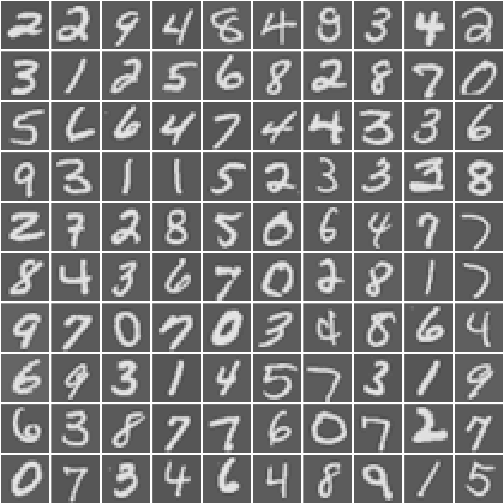

# Muti-Class classification

## visualize the data


```r
require("R.matlab")
dat <- readMat("./mlclass-ex3/ex3data1.mat")
set.seed(1)
X <- dat$X
y <- as.numeric(dat$y)
n <- 100
sx <- X[sample(1:nrow(X), n), ]
rotate <- function(x) t(apply(x, 2, rev))  # rotate a matrix 90 degrees by clockwise
pixelMatrix <- function(x) rotate(matrix(x/max(abs(x)), 20, 20))
# image(pixelMatrix(X[2100, ]), col=gray.colors(100), axes=F)
displayData <- function(x, ...){
    if (nrow(x) == 1) {
        op <- par(mar=c(.1, .1, 2, .1))
        image(pixelMatrix(x), col=gray.colors(100),
              axes=F, ...)
    }
    else{
        op <- par(mar=c(.1, .1, .1, .1))
        width <- floor(sqrt(nrow(x)))
        height <- ceiling(nrow(x) / width)
        layout(matrix(c(1:nrow(x), rep(0, abs(width*height - nrow(x)))),
                    height, width))
        for (i in 1:nrow(x)){
            image(pixelMatrix(x[i, ]), col=gray.colors(100), axes=F,
                ...)
        }
    }
    par(op)
}
displayData(sx)
```

 

## one vs. all


```r
sigmoid <- function(z){ 1 / (1 + exp(-z)) }

costFun <- function(theta, X, y, lambda){
    n <- length(y)
    h <- sigmoid(X %*% theta)
    thetaFiltered <- c(0, theta[-1])
    costPos <- -t(y) %*%  log(h)
    costNeg <- t(1 - y) %*% log(1 - h)
    reg <- (lambda / (2*n)) * (t(thetaFiltered) %*% thetaFiltered)
    costs <- as.vector((1/n) * (costPos - costNeg) + reg)
    costs
}
# theta <- rep(0, ncol(X))
# costFun(c(0, theta), cbind(1, X), y, .1)

gradFun <- function(theta, X, y, lambda){
    n <- length(y)
    h <- sigmoid(X %*% theta)
    thetaFiltered <- c(0, theta[-1])
    grad <- (1/n) * (t(X) %*% (h - y)) + ((lambda / n) * thetaFiltered);
    as.vector(grad)
}
# a <- gradFun(c(0, theta), cbind(1, X), y, lambda)
# costFun(a, cbind(1, X), y, .1)

oneVsAll <- function(X, y, label_num, lambda, trace=0){
    n <- ncol(X)
    X <- as.matrix(cbind(1, X))
    allTheta <- matrix(0, label_num, n + 1)
    theta <- rep(0, n+1)
    for (i in 1:label_num){
        res <- nlminb(theta, costFun, gradFun,
                      X=X, y=as.numeric(y == i),
                      lambda=lambda,
                      control=list(maxit=4000, trace=trace))
        allTheta[i, ] <- res$par
    }
    allTheta
}

lambda <- 0.1
# res <- nlminb(c(0, theta), costFun, gradFun,
#              X=cbind(1, X), y=as.numeric(y==2),
#              lambda=0.1, control=list(maxit=4000))
# quantile(res$par)
res <- oneVsAll(X, y, 10, lambda)

cres <- apply(sigmoid(cbind(1, X) %*% t(res)), 1, which.max)
acc <- table(cres, y)
cat("The predict accuracy is ", 100 * sum(diag(acc)) / sum(acc), "%.\n", sep="")
```

```
The predict accuracy is 96.24%.
```

## neural network with feedforward propagation algorithms


```r
nn.weights <- readMat("./mlclass-ex3/ex3weights.mat")

predictNN <- function(theta1, theta2, X){
    n <- nrow(X)
    labelNum <- nrow(theta2)
    p <- rep(0, n)

    # input layer
    a1 <- cbind(1, X)                 # 5000 * 401
    z2 <- theta1 %*% t(a1)            # 25 * 5000
    # hidden layer
    a2 <- sigmoid(z2)                 # 25 * 5000
    a2 <- rbind(1, a2)                # 26 * 5000
    # input layer
    z3 <- theta2 %*% a2               # 10 * 5000
    a3 <- sigmoid(z3)

    apply(a3, 2, which.max)

}

n <- nrow(X)
pred <- predictNN(nn.weights$Theta1,
                  nn.weights$Theta2,
                  X)
acc <- table(pred, y)
cat("The predict accuracy is ", 100 * sum(diag(acc)) / sum(acc), "%.\n", sep="")
```

```
The predict accuracy is 97.52%.
```


```r
# random pick 10 pics
seln <- sample(1:n, 10)
for (i in seln){
    sx <- t(X[i, ])
    predNum <- predictNN(nn.weights$Theta1,
                         nn.weights$Theta2,
                         sx)
    txt <- sprintf("Neural Network Prediction: %d (digit %d)",
                   predNum, predNum %% 10)
    displayData(sx, main=txt)
}
```

<video   controls loop><source src="figure/unnamed-chunk-5-.webm" />video of chunk unnamed-chunk-5</video>


**ffmpeg problem**

it's annoying when I wanted to display an animation with knitr, it needed ffmpeg from external tools to convert PNG into a webcam. Federa can't easily install this tools. Finally I got a solution to install

```{sh, eval=F}
# find a proper version of rpmfusion which included ffmpeg
wget -c http://download1.rpmfusion.org/free/fedora/releases/21/Everything/x86_64/os/repoview/rpmfusion-free-release.html
# then
yum install ffmpeg
```

also I realized that also I can alternate the convertion tools with knitr, it came into an easy way by setting `opt_chunk$set(animation.fun="hook_scianimator")`


