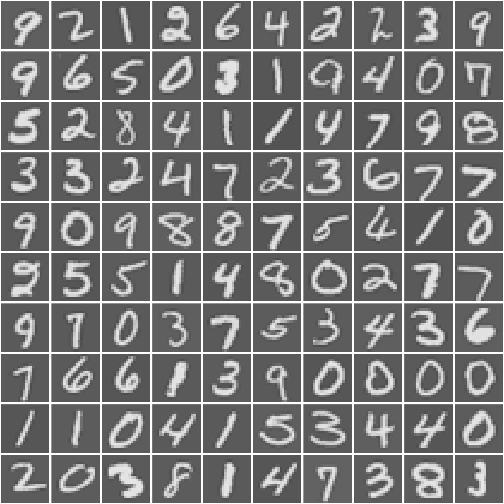
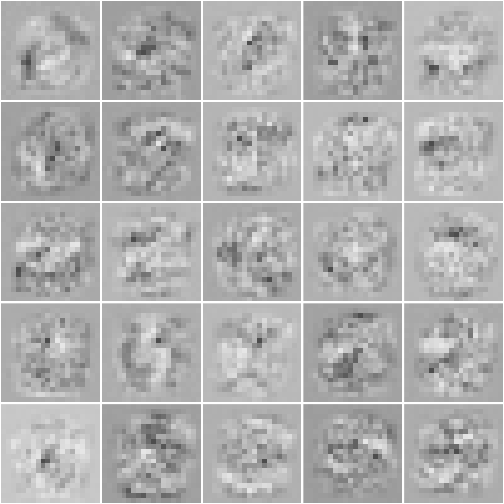

## back propagation algorithm to learn the parameters for neural network

## display the sample data


```r
# source("displayData.r")
source("./loadFun.r")
require("R.matlab")
```

```
Loading required package: R.matlab
R.matlab v3.2.0 (2015-02-24) successfully loaded. See ?R.matlab for help.

Attaching package: 'R.matlab'

The following objects are masked from 'package:base':

    getOption, isOpen
```

```r
dat <- readMat("./mlclass-ex4/ex4data1.mat")
displayData(dat$X[sample(1:5000, 100),])
```

 

## feedforward with no regularization


```r
nn.weights <- readMat("./mlclass-ex4/ex4weights.mat")
inputLayerSize <- 400
hiddenLayerSize <- 25
numLabel <- 10
lambda <- 0
X <- dat$X
y <- dat$y
nnPara <- c(nn.weights$Theta1, nn.weights$Theta2)

J <- nnCostFun(nnPara, inputLayerSize, hiddenLayerSize, numLabel,
               X, y, lambda)
J
```

```
[1] 0.2876292
```

```r
lambda <- 1
J <- nnCostFun(nnPara, inputLayerSize, hiddenLayerSize, numLabel,
               X, y, lambda)
J
```

```
[1] 0.3837699
```

```r
# sigmoidgradient test
sigmoidGradient(c(1, -0.5, 0, 0.5, 1));
```

```
[1] 0.1966119 0.2350037 0.2500000 0.2350037 0.1966119
```

## initial random thetas


```r
# backpropagation begin

## check gradients
debugInitilizeWeights <- function(l.out, l.in){

    w <- matrix(0, nrow=l.out, ncol=1 + l.in)

    w <- array(sin(1:length(w)), dim(w)) / 10

    w

}

computeNumericalGradient <- function(J, theta){

    numGrad <- rep(0, length(theta))
    perturb <- numGrad
    e <- 1e-4

    for (i in 1:length(perturb)){

        perturb[i] <- e
        loss1 <- J(theta - perturb)
        loss2 <- J(theta + perturb)

        numGrad[i] <- (loss2 - loss1) / (2*e)
        perturb[i] <- 0
    }

    numGrad
}

checkNNGradients <- function(lambda=NULL){

    if (is.null(lambda)) lambda <- 0

    inputLayerSize <- 3
    hiddenLayerSize <- 5
    numLabel <- 3
    m <- 5

    theta1.test <- debugInitilizeWeights(hiddenLayerSize, inputLayerSize)
    theta2.test <- debugInitilizeWeights(numLabel, hiddenLayerSize)

    X <- debugInitilizeWeights(m, inputLayerSize - 1)
    y <- 1 + (1:m) %/% numLabel

    nnPara.test <- c(theta1.test, theta2.test)

    costsFun <- function(p) nnCostFun(p, inputLayerSize, hiddenLayerSize, numLabel,
                                      X, y, lambda)

    grads <- nnGradFun(nnPara.test, inputLayerSize, hiddenLayerSize, numLabel,
                       X, y, lambda)

    numgrad <- c(computeNumericalGradient(costsFun, nnPara.test))

    print("the gradients comparison is:")
    print(cbind(numgrad, grads))

    diffs <- norm(matrix(numgrad - grads)) / norm(matrix(numgrad + grads))

    sprintf("Relative Difference: %s", format(diffs, 5))

}

lambda <- 3
checkNNGradients(lambda)
```

```
[1] "the gradients comparison is:"
           numgrad        grads
 [1,] -0.003503603 -0.003503603
 [2,]  0.004794338  0.004794338
 [3,] -0.006005476 -0.006005476
 [4,]  0.007077696  0.007077696
 [5,] -0.008003296 -0.008003296
 [6,] -0.016947023 -0.016947023
 [7,]  0.039714756  0.039714756
 [8,]  0.058957120  0.058957120
 [9,]  0.025230935  0.025230935
[10,] -0.033233882 -0.033233882
[11,] -0.060074303 -0.060074303
[12,] -0.032095154 -0.032095154
[13,]  0.025088178  0.025088178
[14,]  0.059578211  0.059578211
[15,]  0.038858547  0.038858547
[16,] -0.017134593 -0.017134593
[17,] -0.057923119 -0.057923119
[18,] -0.044723985 -0.044723985
[19,]  0.008569236  0.008569236
[20,]  0.055279282  0.055279282
[21,]  0.114544970  0.114544970
[22,] -0.088943412 -0.088943412
[23,]  0.497400697  0.497400697
[24,]  0.014115689  0.014115689
[25,] -0.103738673 -0.103738673
[26,]  0.242036502  0.242036502
[27,]  0.097813975  0.097813975
[28,]  0.014335904  0.014335904
[29,]  0.284465609  0.284465609
[30,]  0.023590186  0.023590186
[31,] -0.103335574 -0.103335574
[32,]  0.218335281  0.218335281
[33,]  0.080237588  0.080237588
[34,]  0.016743199  0.016743199
[35,]  0.278652800  0.278652800
[36,]  0.038611292  0.038611292
[37,] -0.101366907 -0.101366907
[38,]  0.192020590  0.192020590
```

```
[1] "Relative Difference: 1.333647e-11"
```

```r
## training neural network

theta1.init <- randInitializeWeights(inputLayerSize, hiddenLayerSize)
theta2.init <- randInitializeWeights(hiddenLayerSize, numLabel)

# unroll parameters
thetaVec <- c(theta1.init, theta2.init)

lambda <- .8
res <- nlminb(thetaVec, nnCostFun, nnGradFun,
              inputLayerSize=inputLayerSize,
              hiddenLayerSize=hiddenLayerSize,
              numLabel=numLabel,
              X=X, y=y, lambda=lambda, control=list(maxit=500))
              # X=X, y=y, lambda=lambda, control=list(maxit=500, trace=T))

theta1 <- array(res$par[1:(hiddenLayerSize * (1 + inputLayerSize))],
                c(hiddenLayerSize, 1 + inputLayerSize))   # 25 * 401
theta2 <- array(res$par[(1 + (hiddenLayerSize * (1 + inputLayerSize))):length(res$par)],
                c(numLabel, hiddenLayerSize + 1))         # 10 * 26

displayData(theta1[, -1])
```

 

```r
predictNN <- function(theta1, theta2, X){

    m <- nrow(theta1)
    numLabel <- nrow(theta2)

    p <- matrix(0, nrow=m, ncol=1)
    h1 <- sigmoid(cbind(1, X) %*% t(theta1))
    h2 <- sigmoid(cbind(1, h1) %*% t(theta2))

    apply(h2, 1, which.max)

}

pred <- predictNN(theta1, theta2, X)
acc <- table(pred, y)

sprintf("the accuracy is %s%%", format(sum(diag(acc))/sum(acc) * 100, 5))
```

```
[1] "the accuracy is 99.32%"
```
